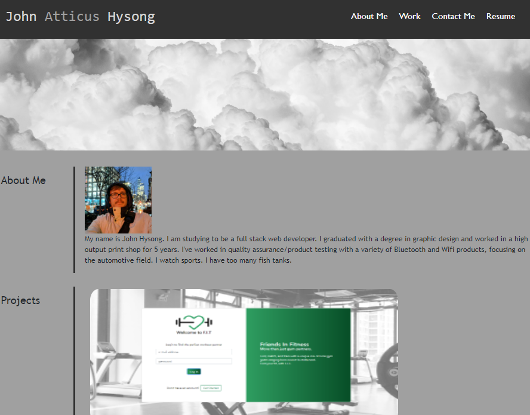

# Porfolio Project
**John Hysong personal portfolio landing page project**

This is the second homework assignment for UCF Coding bootcamp. The website was to focus on using flex boxes/flex elements to create a reactive page that would scale to various device screens.

[johnahysong@gmail.com](mailto:johnahysong@gmail.com)

- [Live Link](https://johnatticus.github.io/John-H-Portfolio/)
- [Repo](https://github.com/johnatticus/John-H-Portfolio)
